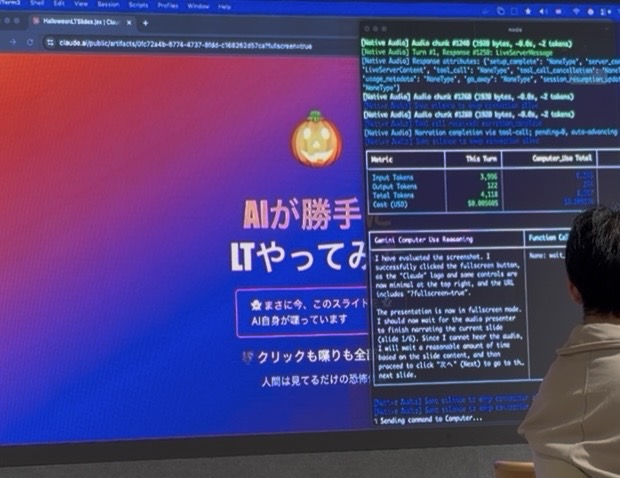

# Computer Use Preview (Native Audio Narration Fork)

This fork layers slide narration upgrades on top of the official Computer Use Preview:
Gemini Native Audio Live API support for real-time, proactive narration, refreshed CLI
options for the presenter workflow, and a streamlined flash-based fallback for macOS `say`.

🎥 Watch the demo clip in this [X post](https://x.com/kenichiNaoe/status/1983143882419589160).
[](https://x.com/kenichiNaoe/status/1983143882419589160)

## Quick Start

This section will guide you through setting up and running the Computer Use Preview model, either the Gemini Developer API or Vertex AI. Follow these steps to get started.

### 1. Installation

**Clone the Repository**

```bash
git clone https://github.com/google/computer-use-preview.git
cd computer-use-preview
```

**Set up Python Virtual Environment and Install Dependencies**

```bash
python3 -m venv .venv
source .venv/bin/activate
pip install -r requirements.txt
```

**Install Playwright and Browser Dependencies**

```bash
# Install system dependencies required by Playwright for Chrome
playwright install-deps chrome

# Install the Chrome browser for Playwright
playwright install chrome
```

### 2. Configuration
You can get started using either the Gemini Developer API or Vertex AI.

#### A. If using the Gemini Developer API:

You need a Gemini API key to use the agent:

```bash
export GEMINI_API_KEY="YOUR_GEMINI_API_KEY"
```

Or to add this to your virtual environment:

```bash
echo 'export GEMINI_API_KEY="YOUR_GEMINI_API_KEY"' >> .venv/bin/activate
# After editing, you'll need to deactivate and reactivate your virtual
# environment if it's already active:
deactivate
source .venv/bin/activate
```

Replace `YOUR_GEMINI_API_KEY` with your actual key.

#### B. If using the Vertex AI Client:

You need to explicitly use Vertex AI, then provide project and location to use the agent:

```bash
export USE_VERTEXAI=true
export VERTEXAI_PROJECT="YOUR_PROJECT_ID"
export VERTEXAI_LOCATION="YOUR_LOCATION"
```

Or to add this to your virtual environment:

```bash
echo 'export USE_VERTEXAI=true' >> .venv/bin/activate
echo 'export VERTEXAI_PROJECT="your-project-id"' >> .venv/bin/activate
echo 'export VERTEXAI_LOCATION="your-location"' >> .venv/bin/activate
# After editing, you'll need to deactivate and reactivate your virtual
# environment if it's already active:
deactivate
source .venv/bin/activate
```

Replace `YOUR_PROJECT_ID` and `YOUR_LOCATION` with your actual project and location.

### 3. Running the Tool

The primary way to use the tool is via the `main.py` script.

**General Command Structure:**

```bash
python main.py --query "Go to Google and type 'Hello World' into the search bar"
```

**Available Environments:**

You can specify a particular environment with the ```--env <environment>``` flag.  Available options:

- `playwright`: Runs the browser locally using Playwright.
- `browserbase`: Connects to a Browserbase instance.

**Local Playwright**

Runs the agent using a Chrome browser instance controlled locally by Playwright.

```bash
python main.py --query="Go to Google and type 'Hello World' into the search bar" --env="playwright"
```

You can also specify an initial URL for the Playwright environment:

```bash
python main.py --query="Go to Google and type 'Hello World' into the search bar" --env="playwright" --initial_url="https://www.google.com/search?q=latest+AI+news"
```

**Browserbase**

Runs the agent using Browserbase as the browser backend. Ensure the proper Browserbase environment variables are set:`BROWSERBASE_API_KEY` and `BROWSERBASE_PROJECT_ID`.

```bash
python main.py --query="Go to Google and type 'Hello World' into the search bar" --env="browserbase"
```

## Agent CLI

The `main.py` script is the command-line interface (CLI) for running the browser agent.

### Command-Line Arguments

| Argument            | Description                                                                                                                            | Required | Default                 | Supported Environment(s) |
| ------------------- | -------------------------------------------------------------------------------------------------------------------------------------- | -------- | ----------------------- | ------------------------ |
| `--query`           | The natural language query for the browser agent to execute.                                                                           | Yes      | N/A                     | All                      |
| `--env`             | The computer use environment to use. Must be one of the following: `playwright`, or `browserbase`                                      | No       | N/A                     | All                      |
| `--initial_url`     | The initial URL to load when the browser starts.                                                                                       | No       | https://www.google.com  | All                      |
| `--highlight_mouse` | If specified, the agent will attempt to highlight the mouse cursor's position in the screenshots. This is useful for visual debugging. | No       | False (not highlighted) | `playwright`             |
| `--slide-audio`     | Enable automatic narration for presentation slides (see below for advanced options).                                                   | No       | False                   | All                      |

#### Slide Audio Narration

You can have the agent narrate browser-based presentations in real time. Two backends are available:

##### Say Backend (macOS only)
Every screenshot is routed to a lightweight Gemini `gemini-2.5-flash` prompt that decides whether to speak and, when appropriate, returns the narration script. The script is then spoken using macOS `say` command.

- macOS users can rely on the built-in `say` command; it is automatically detected when you pass `--slide-audio`.
- Use `--slide-audio-warmup "Testing slide narration"` to trigger a short macOS `say` preview right after the browser session starts.
- Additional controls include `--slide-audio-voice`, `--slide-audio-rate`, `--slide-audio-cooldown`, and `--slide-audio-debug`.
- Override the flash model with the `FLASH_NARRATION_MODEL` environment variable if you need a different Gemini variant.

Example command to validate narration with macOS `say`:

```bash
python main.py \
  --query "Open my Google Slides deck and move through the slides" \
  --env playwright \
  --slide-audio \
  --slide-audio-backend say \
  --slide-audio-warmup "Slide narration is ready via macOS say."
```

##### Native Audio Backend (Cross-platform)
Uses Gemini Native Audio Live API for real-time audio generation. Browser screenshots are continuously streamed to the model, which autonomously generates audio narration.

- Requires PyAudio: `brew install portaudio && pip install pyaudio` (macOS)
- No Flash narration prompt needed - the model speaks directly from video input
- Supports custom frame rates, models, and system instructions
- Additional controls include `--slide-audio-native-model`, `--slide-audio-native-instruction`, `--slide-audio-frame-rate`

Example command with Native Audio backend:

```bash
python main.py \
  --query "Present the slides at example.com/presentation" \
  --env playwright \
  --slide-audio \
  --slide-audio-backend native-audio \
  --slide-audio-frame-rate 1.0 \
  --slide-audio-debug
```

See [AGENTS.md](AGENTS.md) for detailed architecture and troubleshooting.

### Environment Variables

| Variable               | Description                        | Required                                     |
| ---------------------- | ---------------------------------- | -------------------------------------------- |
| GEMINI_API_KEY         | Your API key for the Gemini model. | Yes                                          |
| BROWSERBASE_API_KEY    | Your API key for Browserbase.      | Yes (when using the browserbase environment) |
| BROWSERBASE_PROJECT_ID | Your Project ID for Browserbase.   | Yes (when using the browserbase environment) |
